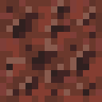
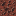

# Scoria (for Fabric)

Scoria is a mod that adds a sponge that can be used for Lava!  

## Scoria 

Scoria is a real life rock! I chose it because it looked sponge-like. It sucks up Lava the way a Sponge does Water, 4 blocks taxi-cab distance 
from the sponge.  

## Molten Scoria 

Molten Scoria is what Scoria turns into when it absorbs Lava! Similar to the Magma Block, stepping on it hurts and it 
emits light. Placing it in places where it snows will cause it to turn back into Scoria!  It can also be surrounded by
8 Ice in the Crafting Table to convert it back. Molten Scoria is obtained by killing Piglin Brutes or it can be found 
in the Treasure Bastion's treasure chest.

### Credits
Artwork made by <a href=https://www.instagram.com/platypuspropaganda/>PlatypusPropaganda</a>.